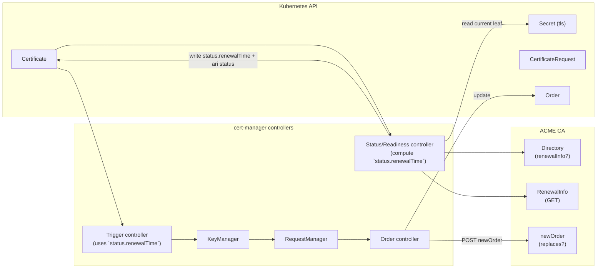

# Design: Integrate ACME ARI (RFC 9773) into cert-manager

> Draft (2026-03-04)  
> Feature gate (proposed): `ACMEARI`  
> Applies to: ACME Issuer / ClusterIssuer only  

## Author
- @hjoshi123 - Hemant Joshi

## Table of Contents

- [Summary](#summary)
- [Goals](#goals)
- [Non-Goals](#non-goals)
- [Terminology](#terminology)
- [High Level Architecture](#high-level-architecture)
  - [Controller flow](#controller-flow)
  - [Key Idea](#key-idea)
  - [Status fields](#status-fields)
- [Risks and Mitigations](#risks-and-mitigations)

## Summary

This design integrates **ACME Renewal Information (ARI)** into cert-manager so that ACME-issued certificates renew at times suggested by the CA, while **also respecting operator-defined renewal windows**.

Key behaviors:

- If the ACME CA advertises ARI (`renewalInfo` in directory), cert-manager periodically fetches RenewalInfo for the currently issued certificate.
- cert-manager selects a renewal instant inside ARI’s `suggestedWindow` (uniform random).
- When placing a renewal order, include ARI’s `replaces` field on newOrder (if ARI supported), using the CertID of the currently issued leaf.

### Goals

- Respect CA guidance for renewal timing (ARI).
- Respect user-defined renewal windows.
- Avoid any behavioral change when ARI unsupported or feature disabled.
- Keep the rest of cert-manager’s renewal pipeline unchanged by driving everything through `Certificate.status.renewalTime`.

### Non-goals

- ARI for non-ACME issuers.
- Changing issuance/challenge logic beyond adding `replaces`.
- Persisting ARI state outside Kubernetes objects.

## Terminology

- **ARI CertID**: `base64url(AKI) + "." + base64url(serial)` derived from the currently issued leaf certificate.
- **ARI suggestedWindow**: `[start, end]` returned by RenewalInfo.
- **User renewal windows**: `spec.renewal.windows` (cron, duration, timezone).

### Process

- ACME Directory may include: `renewalInfo: "<url>"`.
- RenewalInfo endpoint is **unauthenticated GET**:
  - `GET {renewalInfo}/{base64url(AKI)}.{base64url(serial)}`
- Response: `suggestedWindow: { start, end }`, optional `explanationURL`.
- Response header: `Retry-After` indicates next time to re-query RenewalInfo.
- During renewal, client may include `replaces: "<CertID>"` in newOrder payload.

## High-level architecture

We keep the existing controller graph. The only difference is **how `status.renewalTime` is computed** for ACME certswhen ARI is available.

### Controller flow

### Key idea

Reuse existing cert-manager renewal pipeline by **setting `Certificate.status.renewalTime` from ARI**.

- **Readiness/Status controller** (or whichever controller currently computes `renewalTime`) becomes responsible for:
  - Fetching RenewalInfo (when due).
  - Selecting a randomized renewal instant in the suggested window.
    - If `spec.renewal.windows` is configured, cert-manager constrains the selected time to an allowed window:
        - Prefer a time in the intersection `ARI window ∩ user windows`.
        - If no intersection exists, fall back to the earliest user-window time ≥ ARI start (if possible before expiry).
        - If renewal cannot be scheduled under windows before expiry, surface the same “window error” semantics. (Ready=False + reason/message).
  - Writing `status.renewalTime` and ARI-related status.
- **Trigger controller** continues to use `status.renewalTime` to start issuance.
- **ACME issuer/order code** includes `replaces` when placing renewal orders.

### Status fields

This design also aims to introduce the below fields in status to support ARI and let the controllers consume it:

- status.acme.ari.suggestedWindow.start/end — the last fetched CA window
- status.acme.ari.explanationURL — optional CA explanation link
- status.acme.ari.lastChecked — when we last fetched RenewalInfo
- status.acme.ari.nextCheck — when we should fetch next (derived from Retry-After, bounded)
- status.renewalTime — renewal time calculated as usual.

## Risks and Mitigations

- **Risk**: The ARI `suggestedWindow` may not overlap with operator-defined renewal windows (`spec.renewal.windows`). If no feasible time exists before the certificate’s `notAfter`, cert-manager cannot schedule renewal and the certificate could eventually expire.
    
    **Mitigation(s)**:
    - Attempt scheduling within the intersection `ARI window ∩ user windows`.
    - If the intersection is empty, select the earliest feasible time in user windows that is **≥ ARI start**.
    - If no feasible time exists before `notAfter`, surface a **WindowError condition** (consistent with PR #8258 behavior).

